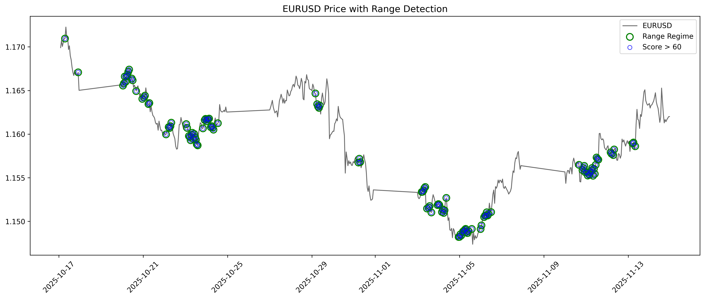
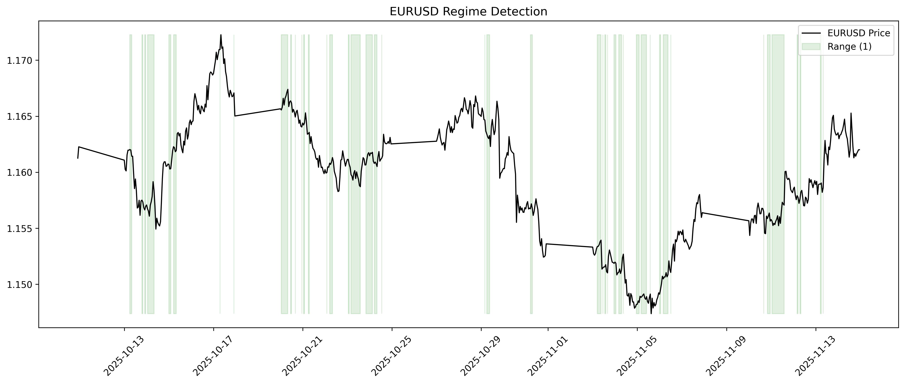

# Statistical Range Detection

## Objective
This project aims to statistically define ranging market conditions using quantitative volatility-based features.

## Project Goal
Develop a statistically grounded indicator capable of identifying volatility compression regimes that are likely to produce ranging market behavior.

## Research Question
How can ranging markets be statistically defined using measurable volatility compression signals?

---

## Market
EURUSD (H1 Timeframe)

---

## Methodology

The project follows a structured quantitative research pipeline:

1. Volatility Hypothesis Definition
2. Feature Engineering (Volatility Compression Signals)
3. Feature Validation (Visual & Statistical)
4. Correlation & Redundancy Analysis
5. Representative Feature Selection
6. Range Score Construction
7. Market Regime Classification
8. Statistical Validation

---

## Features

### ATR Compression ✅

Measures current volatility relative to historical ATR baselines.

**Purpose:** Detect volatility contraction and expansion regimes.

Features:

* atr_rel_16
* atr_rel_48

### Standard Deviation Compression ✅

Measures price dispersion relative to historical standard deviation baselines.

**Purpose:** Quantify changes in market variability.

Features:

* std_rel_16
* std_rel_48

### Candle Range Compression ✅

Measures individual candle-size contraction relative to historical candle ranges.

**Purpose:** Capture local price compression and expansion behavior.

Features:

* range_rel_16
* range_rel_48

### Bollinger Band Width Compression ✅

Measures price containment using normalized Bollinger Band Width.

**Purpose:** Detect periods where price becomes statistically compressed around its moving average.

Features:

* bb_rel_16
* bb_rel_48

### Feature Analysis & Selection ✅
After engineering 8 relative compression features, a full correlation and structural analysis was performed to evaluate feature redundancy and information overlap.

**Analysis Performed:**
* Pearson Correlation Matrix
* Spearman Correlation Matrix
* Cross-horizon correlation comparison (16 vs 48)
* Hierarchical feature clustering
* Feature correlation network visualization

---

### Range Score Model (v1)

Selected features are transformed using percentile rank normalization to ensure comparability across different volatility measures.

**Compression Score:**

* s_i = 1 - rank_pct(x_i)

Where higher values indicate stronger volatility compression.

**Range Score:**

* RangeScore = mean([atr_rel_16_s, std_rel_48_s, range_rel_48_s]) * 100

**Score Interpretation:**

* 0–40 → Volatility Expansion (Trending Regime)

* 40–60 → Neutral / Transitional Regime

* 60–100 → Volatility Compression (Ranging Regime)

This produces a continuous probabilistic score representing the likelihood of a ranging market state.

---

### Key Findings:
* Indicators derived from similar statistical foundations (e.g., STD and Bollinger Width) showed strong correlation.
* Some short and mid-term horizons provided overlapping information.
* Volatility features naturally grouped into structural clusters.

### Selected Feature Set (v1 – Reduced Set):
* atr_rel_16
* std_rel_48
* range_rel_48

### These features were selected to balance:
* Signal stability (longer horizons)
* Information diversity (lower cross-correlation)
* Multi-scale market structure representation

---

## Feature Engineering Status

**Completed Components:**

* ATR Compression
* Standard Deviation Compression
* Candle Range Compression
* Bollinger Band Width Compression

Feature Selection ✅

Correlation Analysis ✅
Redundancy Reduction ✅
Representative Feature Set ✅

Range Score Model ✅
Regime Labeling ✅

**Current Stage:**

Statistical Validation

---

## Visual Validation

Two visual validation approaches were implemented:

### Price + Range Regime Overlay

  

### Continuous Regime Mapping

  

These plots allow qualitative inspection before statistical validation.

---

## Key Insight

Volatility compression is not absolute; it is relative to historical context.

ATR features show clear separation between:
- ranging regimes (low relative ATR)
- trending regimes (high relative ATR)

---

## Project Status

### Completed

* Dataset acquisition and preprocessing
* Exploratory data analysis
* Volatility compression feature engineering
* Feature validation
* Feature correlation analysis
* Hierarchical feature clustering
* Feature redundancy evaluation
* Representative feature selection
* Range Score v1 construction
* Regime labeling
* Visualization framework

### Current Phase

**Statistical Validation of Range Detection Engine**

### Upcoming Work

* Forward return analysis by regime
* Directional efficiency evaluation
* Price containment analysis
* Mean reversion strength estimation

### Research Progression

**The project follows a structured quantitative research pipeline:**

1. Feature Engineering
2. Feature Validation
3. Feature Correlation & Structural Analysis
4. Feature Selection
5. Regime Score Construction
6. Market State Quantification

This ensures that the final Range Score is built on statistically justified and non-redundant components.
