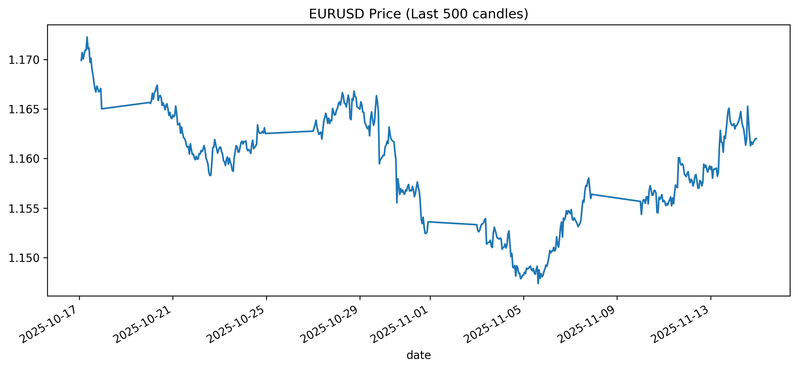
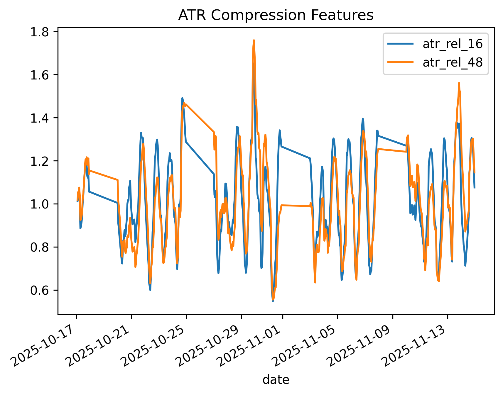

# Statistical Range Detection

## Objective
This project aims to statistically define ranging market conditions using quantitative volatility-based features.

---

## Research Question
How can ranging markets be statistically defined using measurable volatility compression signals?

---

## Market
EURUSD (H1 Timeframe)

---

## Methodology

The project follows a feature-driven research approach:

1. Define volatility-based hypotheses
2. Construct statistical features
3. Validate features visually and statistically
4. Combine multiple weak signals into a regime score

---
## Features

### ATR Compression ✅

Measures current volatility relative to historical ATR baselines.

**Purpose:** Detect volatility contraction and expansion regimes.

Features:

* atr_rel_16
* atr_rel_48

---

### Standard Deviation Compression ✅

Measures price dispersion relative to historical standard deviation baselines.

**Purpose:** Quantify changes in market variability.

Features:

* std_rel_16
* std_rel_48

---

### Candle Range Compression ✅

Measures individual candle-size contraction relative to historical candle ranges.

**Purpose:** Capture local price compression and expansion behavior.

Features:

* range_rel_16
* range_rel_48

---

### Bollinger Band Width Compression ✅

Measures price containment using normalized Bollinger Band Width.

**Purpose:** Detect periods where price becomes statistically compressed around its moving average.

Features:

* bb_rel_16
* bb_rel_48

---

## Feature Engineering Status

Completed Features:

* ATR Compression
* Standard Deviation Compression
* Candle Range Compression
* Bollinger Band Width Compression

Total Engineered Features:

* 8 Relative Compression Features

Current Stage:

* Feature Validation Completed ✅
* Correlation Analysis (Next)
* Range Score Construction (Upcoming)

---

## Visual Validation

### Price Behavior

### ATR Compression Behavior

---

## Key Insight

Volatility compression is not absolute; it is relative to historical context.

ATR features show clear separation between:
- ranging regimes (low relative ATR)
- trending regimes (high relative ATR)

---

## Project Status

### Completed

* Dataset acquisition and preprocessing
* Exploratory data analysis
* ATR Compression feature engineering
* Standard Deviation Compression feature engineering
* Candle Range Compression feature engineering
* Bollinger Band Width feature engineering
* Statistical validation
* Visual validation

### Current Phase

Feature Analysis & Selection

### Upcoming Work

* Correlation analysis
* Feature redundancy evaluation
* Range Score design
* Market regime classification

### Research Question

How can ranging market conditions be statistically defined and quantified?

